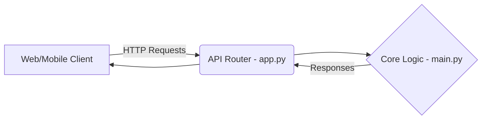

# 🚀 Web App Blueprint (neww)

A minimal, scalable Python web application backend designed for rapid prototyping and deployment.

## 🏗 System Architecture
The application leverages a standard Python API structure.
- **Entry Points**: `app.py` and `main.py` handle server initialization and routing.
- **Environment**: Sensitive keys are managed via `.env`.
- **Dependencies**: Uses modern Python packaging (`pyproject.toml`) alongside standard `requirements.txt`.



## 🛠 Local Setup
1. **Clone & Virtual Environment**:
   It is recommended to use a virtual environment (`venv` or `uv`).
   ```bash
   python -m venv .venv
   source .venv/bin/activate  # On Windows: .venv\Scripts\activate
   ```
2. **Install Packages**:
   ```bash
   pip install -r requirements.txt
   ```
3. **Run Server**:
   ```bash
   python app.py
   ```
